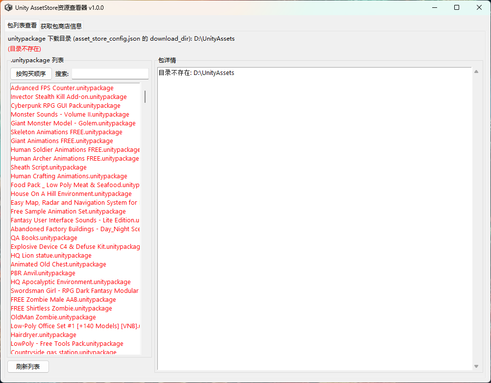
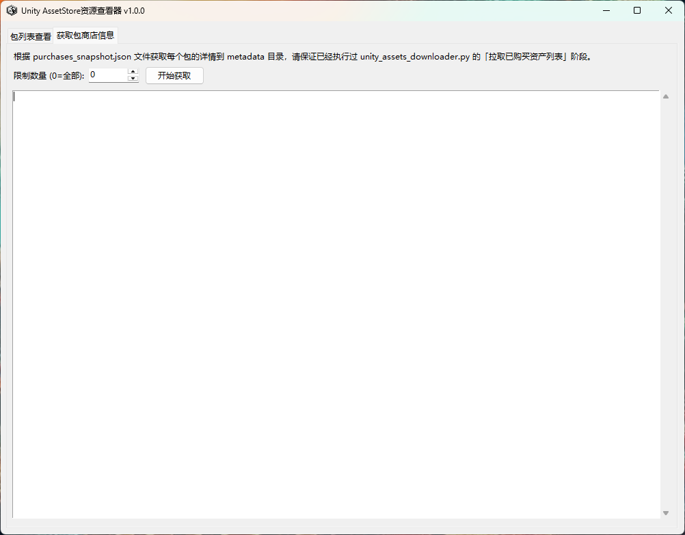

# Unity AssetStore资源查看器

在本地快速浏览已下载的 Unity 素材包，并一键获取每个包的介绍、版本、更新说明等信息。不用反复打开 Unity 编辑器或网页，就能查阅手头素材的完整说明。

---

## 工具能做什么

- **浏览已下载素材**：按下载目录列出所有 `.unitypackage`，支持搜索过滤
- **查看包详情**：选中后直接显示 Overview 描述、版本、出版商、包大小、更新说明等
- **获取包商店信息**：从 Unity API 批量获取包信息并保存到 `metadata` 元数据库目录，之后离线也能查看

适用场景：整理素材库、选包时快速查说明、备份包元数据等。

获取包商店信息通常 1～2 小时即可完成，请保证已经执行过 unity_assets_downloader.py 的「拉取已购买资产列表」阶段。可以优先获取包商店信息提前浏览资源列表，等待 unity_assets_downloader.py 下载结束。

---

## 如何使用

### 1. 获取 exe

从本项目的 Releases 页面下载 `AssetStoreInfo.exe`。

### 2. 放置位置

将 `AssetStoreInfo.exe` 放到 **[AssetStoreZeroDollarShopping](https://github.com/UlyssesWu/AssetStoreZeroDollarShopping) 项目根目录**，与下面这些文件同一级：

```
AssetStoreZeroDollarShopping/
├── asset_store_config.json
├── purchases_snapshot.json
├── cookie.txt
├── unity_assets_downloader.py
├── AssetStoreInfo.exe   ← 放在这里
└── metadata/            ← 包商店信息（运行后自动创建）
```

### 3. 运行

双击 `AssetStoreInfo.exe` 打开。

- **包列表查看**：左侧列出 download_dir 下的素材，可搜索；选中后右侧显示详情

  

- **获取包商店信息**：在第二个标签页设置数量限制（0 表示全部），点击「开始获取」即可

  

---

## 依赖说明

本工具需配合 [AssetStoreZeroDollarShopping](https://github.com/UlyssesWu/AssetStoreZeroDollarShopping) 使用，并从其项目目录中读取以下文件：

| 文件 | 说明 |
|------|------|
| `purchases_snapshot.json` | 已购包列表，通常由 `unity_assets_downloader.py` 生成 |
| `asset_store_config.json` | bearer_token、超时等，手动配置或主脚本自动创建 |
| `cookie.txt` | 浏览器登录态 Cookie，需手动从浏览器获取 |

请先 clone [AssetStoreZeroDollarShopping](https://github.com/UlyssesWu/AssetStoreZeroDollarShopping) 并按说明完成配置，再使用本工具。

---

## 致谢

感谢 [@UlyssesWu](https://github.com/UlyssesWu) 及其项目 [AssetStoreZeroDollarShopping](https://github.com/UlyssesWu/AssetStoreZeroDollarShopping)，为本工具提供了配置、已购列表和 Cookie 的数据来源。

本次合作已受到原作者许可。
